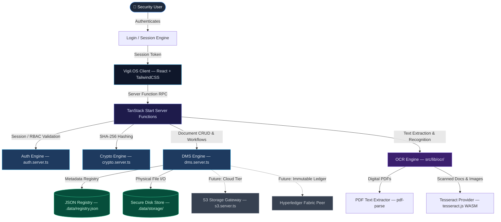
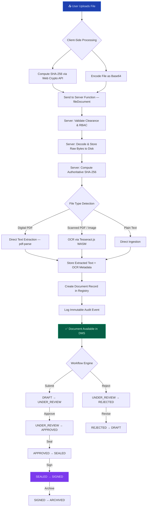
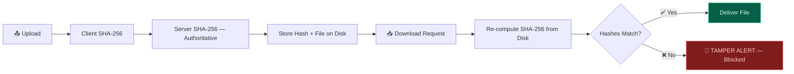
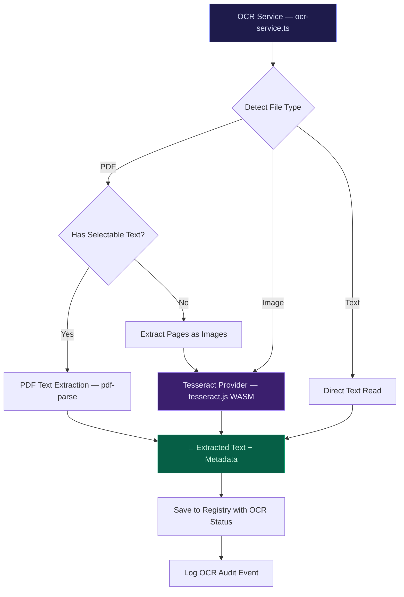
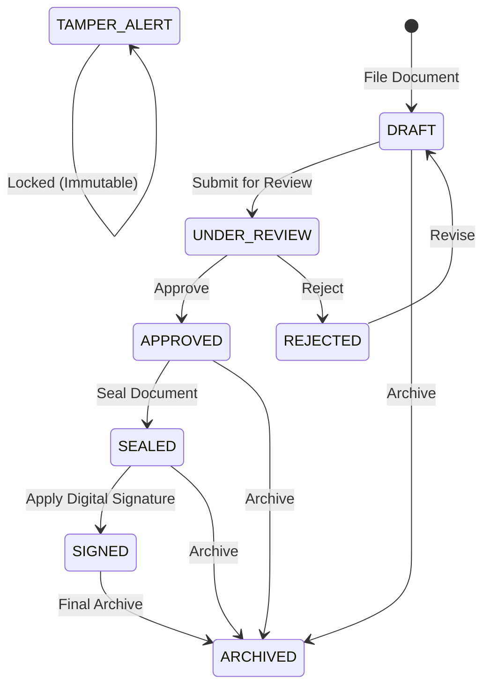
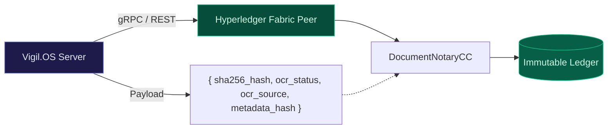

# ⚖️ Vigil.OS — Secure Digital Document Management System

> **A secure, enterprise-grade digital document management system built for law enforcement, judiciary, and forensic investigation teams.**

Vigil.OS provides end-to-end document lifecycle management with **SHA-256 cryptographic integrity**, **Optical Character Recognition (OCR)**, **role-based access control**, **audit logging**, and **blockchain-ready architecture** — built on TanStack Start + React.

---

## 🏗️ High-Level System Architecture



---

## 📄 Complete Document Lifecycle Flow



---

## 🔒 SHA-256 Cryptographic Integrity Engine (SIH 26190)

Vigil.OS implements a forensic-grade **SHA-256 File Integrity Verification System** for legal chain-of-custody compliance:

| Layer | Technology | Purpose |
| :--- | :--- | :--- |
| **Client Pre-Upload** | Web Crypto `SubtleCrypto.digest()` | Instant SHA-256 preview before upload |
| **Server Authoritative** | Node.js `crypto.createHash("sha256")` | Streaming hash computation from raw bytes |
| **Tamper Detection** | `crypto.timingSafeEqual()` | Constant-time comparison to prevent timing attacks |
| **Download Gate** | On-the-fly re-hash | Physical file re-hashed before delivery; mismatches are **blocked** |
| **Tamper Simulation** | Diagnostic tool | Demonstrates real-time tamper alerts for SIH judges |



📖 **Full Technical Documentation**: See [`SHA256_INTEGRITY.md`](SHA256_INTEGRITY.md)

---

## 🔍 OCR Engine — Optical Character Recognition

The OCR subsystem automatically extracts searchable text from uploaded documents using a **modular provider architecture**.

### Supported Formats

| Format | MIME Type | Processing Method |
| :--- | :--- | :--- |
| PDF (Digital) | `application/pdf` | Direct stream text extraction |
| PDF (Scanned) | `application/pdf` | Tesseract OCR on extracted page images |
| PNG | `image/png` | Tesseract OCR |
| JPEG / JPG | `image/jpeg` | Tesseract OCR |
| TIFF / TIF | `image/tiff` | Tesseract OCR |
| Plain Text | `text/plain` | Direct ingestion |

### Supported OCR Languages
- 🇬🇧 **English** (`eng`) — Default
- 🇮🇳 **Hindi** (`hin`) — हिन्दी
- 🇮🇳 **Marathi** (`mar`) — मराठी

### Provider Architecture



> **Forensic Boundary**: The SHA-256 digest is computed from the **original uploaded bytes** before any OCR processing. Re-running OCR never alters the cryptographic hash.

📖 **Full Technical Documentation**: See [`OCR_ARCHITECTURE.md`](OCR_ARCHITECTURE.md)

---

## 🔑 Role-Based Access Control (RBAC)

Five hierarchical clearance levels enforce granular access control across the entire system:

| Role | Clearance | Upload | Sign | Manage Assets | Manage Users | Approve |
| :--- | :---: | :---: | :---: | :---: | :---: | :---: |
| **Admin** | Level 4 | ✅ | ✅ | ✅ | ✅ | ✅ |
| **Investigator** | Level 3 | ✅ | ✅ | ✅ | ❌ | ✅ |
| **Legal Officer** | Level 3 | ✅ | ✅ | ❌ | ❌ | ✅ |
| **Court Officer** | Level 2 | ✅ | ❌ | ❌ | ❌ | ❌ |
| **Viewer** | Level 1 | ❌ | ❌ | ❌ | ❌ | ❌ |

### Document Classification Levels

```
PUBLIC → RESTRICTED → CONFIDENTIAL → SECRET → TOP SECRET
  (0)       (1)           (2)          (3)       (4)
```

Users can only access documents at or below their clearance level.

---

## 📂 Document Workflow State Machine



---

## 🛰️ API Server Functions Reference

All server functions are exposed via TanStack Start RPC (`src/lib/dms.functions.ts`):

### Document Management
| Function | Method | Description |
| :--- | :---: | :--- |
| `fileDocument` | POST | Upload document, store bytes, compute SHA-256, run OCR, log audit |
| `requestDownload` | POST | Download with on-the-fly integrity verification gate |
| `checkIntegrity` | POST | Verify stored document hash against computed hash |
| `advanceWorkflowFn` | POST | Transition document through workflow states |
| `applySignature` | POST | Apply digital signature to sealed documents |
| `reclassifyDocument` | POST | Change document classification level |
| `simulateTamperFn` | POST | Tamper simulation for SIH demonstration |
| `restoreDocumentFn` | POST | Restore a tampered document from backup |

### OCR Operations
| Function | Method | Description |
| :--- | :---: | :--- |
| `triggerOCR` | POST | Manually trigger/re-run OCR with language selection |
| `getExtractedText` | POST | Retrieve extracted text (clearance-gated) |
| `getOCRStatus` | POST | Lightweight OCR status metadata query |

### Case Management
| Function | Method | Description |
| :--- | :---: | :--- |
| `openCase` | POST | Create a new case dossier |
| `updateCaseFn` | POST | Update case status, priority, or assignments |
| `fetchSnapshot` | GET | Full registry snapshot (clearance-filtered) |

### Sharing & Collaboration
| Function | Method | Description |
| :--- | :---: | :--- |
| `shareDocumentFn` | POST | Share document with time-bound permissions |
| `revokeShareFn` | POST | Revoke an active share |
| `toggleShare` | POST | Toggle role-level sharing access |

### Assets & Notifications
| Function | Method | Description |
| :--- | :---: | :--- |
| `inductAsset` | POST | Register a new physical asset |
| `moveAssetStage` | POST | Advance asset lifecycle stage |
| `markNotificationReadFn` | POST | Mark notification as read |
| `markAllNotificationsReadFn` | POST | Mark all notifications as read |

---

## 📁 Repository Structure

```
judicator-docs/
├── .data/
│   ├── registry.json                  # Persistent JSON database
│   └── storage/vigil/cases/           # Physical file storage (per case)
├── public/
│   ├── favicon.png                    # Security shield icon
│   └── robots.txt
├── src/
│   ├── components/
│   │   ├── dms/
│   │   │   ├── actor.tsx              # User identity & role context
│   │   │   ├── analytics-charts.tsx   # Recharts dashboard widgets
│   │   │   ├── confirm-dialog.tsx     # Confirmation modals
│   │   │   ├── notification-bell.tsx  # Real-time notification bell
│   │   │   ├── primitives.tsx         # Shared UI primitives
│   │   │   ├── records.tsx            # Document records table
│   │   │   ├── search-filters.tsx     # Advanced search & filter panel
│   │   │   ├── share-panel.tsx        # Document sharing UI
│   │   │   ├── shell.tsx              # Application shell layout
│   │   │   └── workflow-actions.tsx   # Workflow transition controls
│   │   └── ui/                        # Radix-based reusable components
│   ├── hooks/                         # React state & lifecycle hooks
│   ├── lib/
│   │   ├── auth.server.ts             # Authentication & session engine
│   │   ├── auth.functions.ts          # Auth server function endpoints
│   │   ├── crypto.server.ts           # SHA-256 cryptographic engine
│   │   ├── dms-types.ts               # Core domain type definitions
│   │   ├── dms.functions.ts           # DMS server function endpoints
│   │   ├── dms.server.ts              # DMS business logic (40KB+)
│   │   ├── registry.server.ts         # JSON database adapter
│   │   ├── storage.server.ts          # Physical file storage service
│   │   ├── s3.server.ts               # Cloud storage gateway (future)
│   │   ├── seed-registry.ts           # Demo data seeder
│   │   ├── error-capture.ts           # Error boundary capture
│   │   ├── error-page.ts              # Error page renderer
│   │   ├── error-reporting.ts         # Runtime exception telemetry
│   │   ├── utils.ts                   # Shared utilities
│   │   └── ocr/
│   │       ├── ocr-service.ts         # OCR orchestration service
│   │       ├── ocr-types.ts           # OCR type definitions
│   │       ├── pdf-extractor.ts       # PDF text extraction engine
│   │       └── tesseract-provider.ts  # Tesseract.js WASM provider
│   ├── routes/
│   │   ├── __root.tsx                 # Root layout with providers
│   │   ├── index.tsx                  # Dashboard — analytics & overview
│   │   ├── login.tsx                  # Authentication page
│   │   ├── cases.index.tsx            # Case dossier listing
│   │   ├── cases.$caseId.tsx          # Case detail & document view
│   │   ├── documents.tsx              # Document registry browser
│   │   ├── documents.$docId.tsx       # Document detail & viewer (31KB+)
│   │   ├── audit.tsx                  # Security audit log viewer
│   │   ├── assets.tsx                 # Asset management dashboard
│   │   ├── users.tsx                  # User management panel
│   │   ├── notifications.tsx          # Notification center
│   │   └── profile.tsx                # User profile & settings
│   ├── router.tsx                     # Router initialization
│   ├── server.ts                      # SSR server entry
│   ├── start.ts                       # Client shell mount
│   └── styles.css                     # Global styles
├── tests/
│   ├── integrity.test.ts              # 10 SHA-256 integrity tests
│   └── ocr.test.ts                    # 10 OCR engine tests
├── eng.traineddata                    # Tesseract English language model
├── OCR_ARCHITECTURE.md                # OCR engine technical docs
├── SHA256_INTEGRITY.md                # SHA-256 integrity technical docs
├── package.json
├── tsconfig.json
└── vite.config.ts
```

---

## 🛡️ Security Features

| Feature | Description |
| :--- | :--- |
| **SHA-256 Chain of Custody** | Every file is cryptographically hashed on upload and re-verified on download |
| **Path Traversal Protection** | Storage keys are resolved under `.data/storage/` — no directory escape |
| **Timing-Safe Comparison** | Hash comparisons use `crypto.timingSafeEqual()` to prevent timing attacks |
| **Classification Gating** | Documents above a user's clearance level are invisible |
| **Immutable Audit Trail** | Every action (login, upload, share, sign, OCR) is permanently logged |
| **OCR Error Containment** | Failed OCR never corrupts original files; status tracked separately |
| **Session Management** | Cookie-based sessions with server-side validation |
| **Input Validation** | All server functions validated with Zod schemas |

---

## 🧪 Automated Testing

Run the complete test suite (20 tests):

```bash
# Run all tests
npm test

# Run only SHA-256 integrity tests (10 tests)
npm run test:integrity

# Run only OCR engine tests (10 tests)
npm run test:ocr
```

---

## 🚀 Getting Started

### Prerequisites
- **Node.js** v18+
- **npm** v9+

### Installation

```bash
# 1. Clone the repository
git clone https://github.com/pranavkadam-cs/judicator-docs.git
cd judicator-docs

# 2. Install dependencies
npm install

# 3. Start the development server
npm run dev
```

The application will be available at: **`http://localhost:8080`**

### Production Build

```bash
npm run build
npm run preview
```

---

## 🎫 Demo Credentials

Use these pre-configured accounts to explore different roles:

| Email | Password | Role | Badge ID |
| :--- | :--- | :--- | :--- |
| `admin@vigil.os` | `admin123` | **Admin** | `REC-0001` |
| `investigator@vigil.os` | `invest123` | **Investigator** | `MH-1180` |
| `legal@vigil.os` | `legal123` | **Legal Officer** | `PP-0092` |
| `court@vigil.os` | `court123` | **Court Officer** | `MH-4471` |
| `viewer@vigil.os` | `viewer123` | **Viewer** | `FSL-303` |

---

## 🔗 Hyperledger Fabric — Blockchain Readiness

The system architecture is pre-partitioned for immutable ledger anchoring:



---

## 🛠️ Tech Stack

| Layer | Technology |
| :--- | :--- |
| **Frontend** | React 19, TailwindCSS 4, Radix UI, Recharts, Lucide Icons |
| **Framework** | TanStack Start, TanStack Router, TanStack Query |
| **Backend** | Node.js (SSR), TanStack Server Functions |
| **Crypto** | Node.js `crypto` (SHA-256), Web Crypto API |
| **OCR** | Tesseract.js 7 (WASM), pdf-parse |
| **Validation** | Zod |
| **Database** | JSON file registry (`.data/registry.json`) |
| **Testing** | Node.js native test runner via `tsx` |
| **Build** | Vite 8 |

---

<p align="center">
  <strong>Vigil.OS</strong> — Securing Justice Through Technology<br/>
  <em>Built for SIH Problem Statement 26190</em>
</p>
