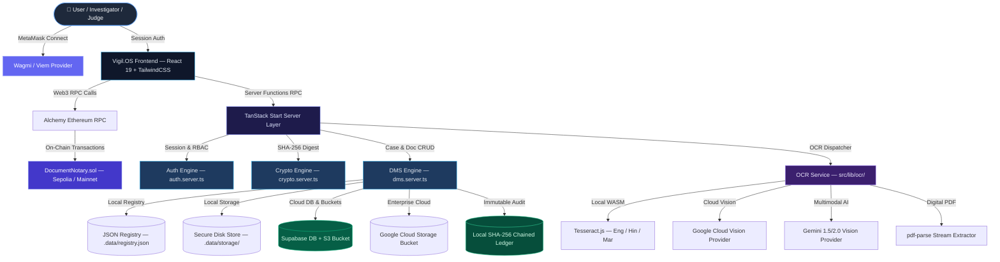
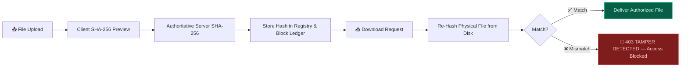
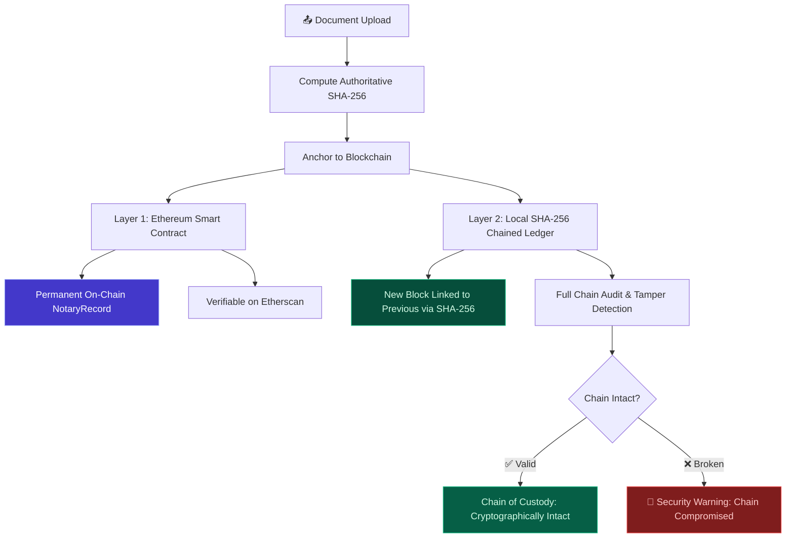
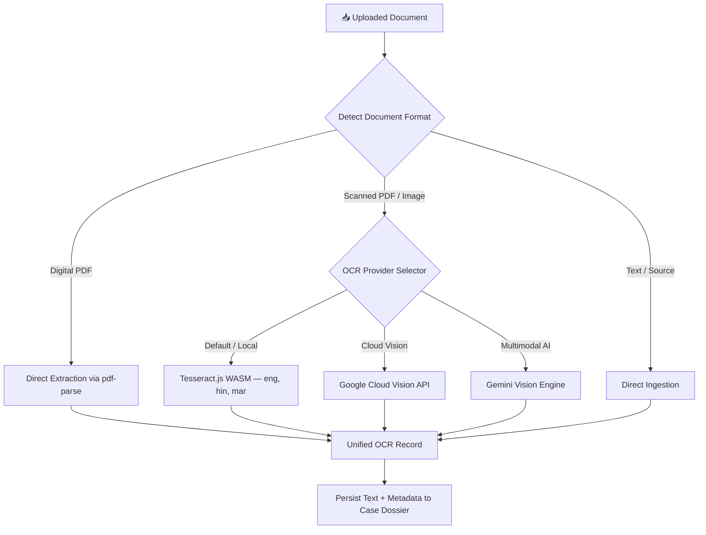
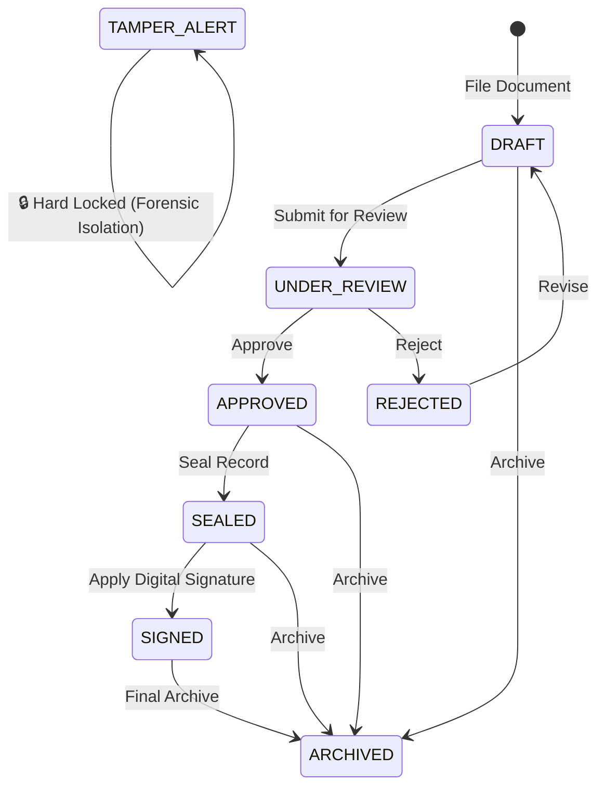

# ⚖️ Vigil.OS — Secure Digital Document Management System

<p align="center">
  
</p>

<p align="center">
  <strong>Forensic-grade digital document lifecycle management, cryptographic integrity verification, multi-engine OCR, and blockchain anchoring.</strong><br/>
  <em>Built for SIH Problem Statement 26190 · Judiciary, Law Enforcement & Forensic Investigation Teams</em>
</p>

<p align="center">
  
  
  
  
  
  
  
  
</p>

---

## 📑 Table of Contents

- [Overview](#-overview)
- [System Architecture](#%EF%B8%8F-system-architecture)
- [Key Architectural Pillars](#-key-architectural-pillars)
  - [1. SHA-256 Forensic Integrity Engine](#1--sha-256-forensic-integrity-engine-sih-26190)
  - [2. Dual-Layer Blockchain Notarization](#2-%EF%B8%8F-dual-layer-blockchain-notarization-sih-26190)
  - [3. Multi-Engine OCR Processing](#3--multi-engine-ocr-processing-pipeline)
  - [4. Role-Based Access Control & Classification](#4--role-based-access-control-rbac)
  - [5. Document Workflow Lifecycle](#5--document-workflow-state-machine)
- [Repository Structure](#-repository-structure)
- [Smart Contract & Web3 Integration](#-smart-contract--web3-integration)
- [Getting Started](#-getting-started)
- [Environment Configuration](#-environment-configuration)
- [Automated Testing](#-automated-testing)
- [API Server Functions](#%EF%B8%8F-api-server-functions-reference)
- [Demo Credentials](#-demo-credentials)

---

## 🌟 Overview

**Vigil.OS** provides a tamper-proof chain of custody for digital evidence, legal petitions, court proceedings, and sensitive case files.

- **Zero-Trust Verification**: Every uploaded file is hashed client-side and server-side with SHA-256; downloads pass through an active gate that re-computes hashes on-the-fly to prevent serving altered content.
- **Ethereum Smart Contract Notarization**: Anchors document hashes permanently on Ethereum (Sepolia testnet / Mainnet) via an immutable Solidity smart contract (`DocumentNotary.sol`) integrated with MetaMask and Alchemy RPC.
- **Local Cryptographic Ledger**: Maintains a chained SHA-256 audit ledger (`.data/blockchain-ledger.json`) with cryptographic block linkage, Genesis block verification, and real-time tamper detection.
- **Tri-Engine Intelligent OCR**: Automatically extracts text from digital PDFs, scanned images, and multi-page documents using local Tesseract WASM, Google Cloud Vision, or Google Gemini AI Vision.
- **Hybrid Storage Backends**: Supports local filesystem storage, Supabase Storage, and Google Cloud Storage (GCS).

---

## 🏗️ System Architecture



---

## 🔑 Key Architectural Pillars

### 1. 🔒 SHA-256 Forensic Integrity Engine (SIH 26190)

Vigil.OS strictly satisfies legal evidentiary admissibility standards by enforcing cryptographic integrity across every touchpoint:

| Checkpoint | Implementation | Protection |
| :--- | :--- | :--- |
| **Client Pre-Hash** | Web Crypto `SubtleCrypto.digest("SHA-256")` | Computes preview digest prior to transmission |
| **Server Digest** | Node.js `crypto.createHash("sha256")` | Streaming hash computation from raw uploaded bytes |
| **Tamper Defense** | `crypto.timingSafeEqual()` | Constant-time comparison to prevent side-channel timing attacks |
| **Download Gate** | Active streaming re-hash | Physical file re-hashed before transfer; mismatches trigger `TAMPER_ALERT` |
| **Tamper Diagnostic** | Simulation endpoint (`simulateTamperFn`) | Injects byte flips for live judge demonstrations and recovery tests |



📖 **Detailed Documentation**: See [`SHA256_INTEGRITY.md`](SHA256_INTEGRITY.md)

---

### 2. ⛓️ Dual-Layer Blockchain Notarization (SIH 26190)

Vigil.OS directly addresses **SIH Problem Statement 26190** by implementing a dual-layer blockchain notarization system that provides immutable, cryptographically verifiable proof-of-existence and chain-of-custody for all digital evidence and legal documents:

#### A. Public Ethereum Notarization (MetaMask + Alchemy)
- **Smart Contract**: [`contracts/DocumentNotary.sol`](contracts/DocumentNotary.sol) compiled with Solidity `^0.8.20`.
- **Permanent On-Chain Storage**:
  ```solidity
  struct NotaryRecord {
      bytes32 sha256Hash;       // SHA-256 hash of document
      string  documentId;       // Vigil.OS internal document ID
      string  documentName;     // Document name
      address notarizedBy;      // Signer wallet address
      uint256 timestamp;        // Immutable block timestamp
      bool    exists;           // Anti-overwrite guard
  }
  ```
- **Live Wallet Connectivity**: Connects to MetaMask using Wagmi v2 and Viem.
- **Alchemy Infrastructure**: High-throughput JSON-RPC endpoints configured for Ethereum Sepolia testnet or Ethereum Mainnet.
- **Contract Verification**: Direct deep-links to [Sepolia Etherscan](https://sepolia.etherscan.io).

#### B. Local Chained Cryptographic Ledger
- Implemented in `src/lib/blockchain.server.ts`.
- Chained JSON ledger (`.data/blockchain-ledger.json`) linking each notarization to the previous block's SHA-256 hash.
- Cryptographic chain link: `txId = SHA-256(prevTxId : metadataHash : timestamp)` — any single tampered block breaks the entire chain.
- Independent validation endpoint (`verifyBlockchainEntryFn`) capable of auditing complete block chains and isolating tampered blocks.
- **Enterprise-Ready**: Drop-in hooks ready for Hyperledger Fabric peers via gRPC.



📖 **Detailed Documentation**: See [`BLOCKCHAIN_ARCHITECTURE.md`](BLOCKCHAIN_ARCHITECTURE.md)

---

### 3. 🔍 Multi-Engine OCR Processing Pipeline

The OCR subsystem extracts text, determines searchable indices, and structures forensic evidence across image and scanned document types:



- **Languages Supported**: English (`eng`), Hindi (`hin`), Marathi (`mar`).
- **Forensic Guarantee**: The SHA-256 cryptographic digest is calculated strictly from raw file bytes before OCR parsing. Re-running OCR never impacts the document's cryptographic hash.

📖 **Detailed Documentation**: See [`OCR_ARCHITECTURE.md`](OCR_ARCHITECTURE.md)

---

### 4. 🔑 Role-Based Access Control (RBAC)

Five clearance tiers enforce role-based access to dossiers and documents:

| Role | Clearance | File Upload | Sign & Seal | Induct Assets | User Admin | Review & Approve |
| :--- | :---: | :---: | :---: | :---: | :---: | :---: |
| **Admin** | Level 4 | ✅ | ✅ | ✅ | ✅ | ✅ |
| **Investigator** | Level 3 | ✅ | ✅ | ✅ | ❌ | ✅ |
| **Legal Officer** | Level 3 | ✅ | ✅ | ❌ | ❌ | ✅ |
| **Court Officer** | Level 2 | ✅ | ❌ | ❌ | ❌ | ❌ |
| **Viewer** | Level 1 | ❌ | ❌ | ❌ | ❌ | ❌ |

#### Document Security Classifications
`PUBLIC (0)` → `RESTRICTED (1)` → `CONFIDENTIAL (2)` → `SECRET (3)` → `TOP SECRET (4)`

---

### 5. 📂 Document Workflow State Machine

Documents progress through a strict lifecycle audit chain:



---

## 📁 Repository Structure

```
judicator-docs/
├── contracts/
│   └── DocumentNotary.sol               # Solidity 0.8.20 Smart Contract
├── scripts/
│   └── deploy.cjs                       # Automated deployment & .env update script
├── public/
│   ├── favicon.png                      # Shield security icon
│   └── robots.txt
├── src/
│   ├── components/
│   │   ├── dms/
│   │   │   ├── actor.tsx                # Role badge & user context
│   │   │   ├── analytics-charts.tsx     # Recharts analytics widgets
│   │   │   ├── confirm-dialog.tsx       # Destructive action modals
│   │   │   ├── notification-bell.tsx    # Live notifications
│   │   │   ├── primitives.tsx           # UI stat cards & panels
│   │   │   ├── records.tsx              # Document table
│   │   │   ├── search-filters.tsx       # Search and classification filter
│   │   │   ├── share-panel.tsx          # Temporal document sharing
│   │   │   ├── shell.tsx                # Navigation & application shell
│   │   │   └── workflow-actions.tsx     # State transition action buttons
│   │   └── ui/                          # Radix UI primitives
│   ├── lib/
│   │   ├── auth.functions.ts            # Auth RPC functions
│   │   ├── auth.server.ts               # Session engine & token management
│   │   ├── blockchain.server.ts         # Local SHA-256 chained block ledger
│   │   ├── crypto.server.ts             # Forensic SHA-256 crypto engine
│   │   ├── dms-types.ts                 # Domain TypeScript interfaces
│   │   ├── dms.functions.ts             # DMS RPC server functions
│   │   ├── dms.server.ts                # DMS business logic & workflows
│   │   ├── google-cloud-storage.server.ts # GCS bucket client
│   │   ├── registry.server.ts           # JSON database abstraction
│   │   ├── storage.server.ts            # Local disk filesystem adapter
│   │   ├── supabase-storage.server.ts   # Supabase object storage client
│   │   ├── supabase.ts                  # Supabase database client
│   │   ├── ethereum/                    # Web3 & Ethereum integration
│   │   │   ├── config.ts                # Wagmi / Viem chain configuration
│   │   │   ├── contract.ts              # Contract ABI & addresses
│   │   │   ├── NotarizeButton.tsx       # On-chain notarization action UI
│   │   │   ├── WalletButton.tsx         # MetaMask connect / disconnect button
│   │   │   ├── useNotarize.ts           # Wagmi notarize mutation hook
│   │   │   └── useVerifyOnChain.ts      # On-chain verification query hook
│   │   └── ocr/                         # OCR engine providers
│   │       ├── gemini-ocr-provider.ts   # Gemini Vision AI provider
│   │       ├── google-vision-provider.ts # Google Cloud Vision provider
│   │       ├── ocr-service.ts           # Orchestrator & dispatcher
│   │       ├── ocr-types.ts             # OCR contracts & types
│   │       ├── pdf-extractor.ts         # Direct stream PDF extractor
│   │       └── tesseract-provider.ts    # Tesseract.js WASM provider
│   ├── routes/
│   │   ├── __root.tsx                   # Root layout with Wagmi & Query providers
│   │   ├── index.tsx                    # Executive dashboard & metrics
│   │   ├── login.tsx                    # User authentication page
│   │   ├── blockchain.tsx               # Dual Ledger & Ethereum Notary UI
│   │   ├── cases.index.tsx              # Case dossier index
│   │   ├── cases.$caseId.tsx            # Case dossier document workspace
│   │   ├── documents.tsx                # Global document directory
│   │   ├── documents.$docId.tsx         # Forensic document viewer & on-chain notarize
│   │   ├── audit.tsx                    # System audit trail viewer
│   │   ├── assets.tsx                   # Physical evidence & asset tracker
│   │   ├── users.tsx                    # User management & role assignment
│   │   ├── notifications.tsx            # Alert center
│   │   └── profile.tsx                  # Profile and credentials view
├── tests/
│   ├── integrity.test.ts                # 12 SHA-256 integrity unit tests
│   └── ocr.test.ts                      # 11 OCR engine unit tests
├── .data/                               # Local persistent storage
│   ├── registry.json                    # Local database file
│   ├── blockchain-ledger.json           # Local SHA-256 block ledger
│   └── storage/vigil/cases/             # Physical file storage directory
├── hardhat.config.cjs                   # Hardhat Solidity compilation config
├── package.json
├── tsconfig.json
└── vite.config.ts
```

---

## ⚡ Smart Contract & Web3 Integration

### 1. Compile the Smart Contract
Compile [`contracts/DocumentNotary.sol`](contracts/DocumentNotary.sol) using Hardhat:
```bash
npm run contract:compile
```

### 2. Deploy to Ethereum Sepolia Testnet
Add your deployer wallet private key to `.env`:
```env
SEPOLIA_PRIVATE_KEY=your_metamask_private_key_here
```
Deploy with one command:
```bash
npm run contract:deploy:sepolia
```
*The script automatically deploys the contract, prints the transaction hash and Etherscan link, and writes the resulting address to `VITE_CONTRACT_ADDRESS` in `.env`.*

### 3. Deploy to Local Test Network
To run an instant deployment against a local in-memory node:
```bash
npm run contract:deploy:local
```

### 4. Alternative: Deploy via Remix IDE
1. Open [remix.ethereum.org](https://remix.ethereum.org).
2. Paste [`contracts/DocumentNotary.sol`](contracts/DocumentNotary.sol).
3. Compile with Solidity `0.8.20`.
4. Under **Deploy & Run Transactions**, select **Injected Provider - MetaMask**.
5. Deploy to Sepolia and paste the deployed address into `VITE_CONTRACT_ADDRESS` in `.env`.

---

## 🚀 Getting Started

### Prerequisites
- **Node.js** v18.0.0 or higher
- **npm** v9.0.0 or higher
- **MetaMask Browser Extension** (for Web3 features)

### Installation

```bash
# 1. Clone the repository
git clone https://github.com/pranavkadam-cs/judicator-docs.git
cd judicator-docs

# 2. Install all dependencies
npm install

# 3. Compile the Solidity smart contract
npm run contract:compile

# 4. Start the local development server
npm run dev
```

Open **`http://localhost:8080`** in your browser.

---

## ⚙️ Environment Configuration

Create a `.env` file in the project root (reference [`.env.example`](.env.example)):

```env
# ── Ethereum / Alchemy / MetaMask (Sepolia Testnet) ────────────
VITE_ALCHEMY_RPC_URL=https://eth-sepolia.g.alchemy.com/v2/your_alchemy_api_key
VITE_ALCHEMY_API_KEY=your_alchemy_api_key
VITE_ETH_NETWORK=sepolia
VITE_CHAIN_ID=11155111
VITE_CONTRACT_ADDRESS=0xYourDeployedContractAddress
SEPOLIA_PRIVATE_KEY=your_private_key_for_cli_deploy

# ── OCR Subsystem (Optional Cloud Providers) ────────────────────
OCR_PROVIDER=auto
GEMINI_API_KEY=
GOOGLE_CLOUD_VISION_API_KEY=
GOOGLE_CLOUD_PROJECT_NUMBER=

# ── Cloud Storage & Database (Optional) ─────────────────────────
SUPABASE_URL=
SUPABASE_ANON_KEY=
SUPABASE_SERVICE_ROLE_KEY=
SUPABASE_STORAGE_BUCKET=evidence-vault

# ── Hyperledger Fabric (Optional Live Enterprise Peer) ──────────
FABRIC_PEER_ENDPOINT=
FABRIC_MSP_ID=
FABRIC_CHANNEL_NAME=
FABRIC_CHAINCODE_NAME=
```

*(If optional cloud keys are left blank, Vigil.OS automatically falls back to local Tesseract OCR and local filesystem storage).*

---

## 🧪 Automated Testing

The repository includes a comprehensive 23-test automated test suite covering SHA-256 integrity, tamper detection, RBAC boundaries, versioning, and the OCR engine:

```bash
# Run all 23 tests
npm test

# Run only SHA-256 integrity & tamper detection tests (12 tests)
npm run test:integrity

# Run only OCR engine tests (11 tests)
npm run test:ocr
```

### Test Suite Summary
```
▶ SIH Problem Statement 26190: SHA-256 File Integrity Verification Engine
  ✔ TEST 1:  Upload file → SHA-256 generated automatically
  ✔ TEST 2:  Identical file → Identical hash
  ✔ TEST 3:  One byte change → Avalanche effect verified
  ✔ TEST 4:  Untouched file download → Verification passes
  ✔ TEST 5:  Tampered file download → Blocked with tamper alert
  ✔ TEST 6:  Missing stored hash → Not silently trusted
  ✔ TEST 7:  Unauthorized clearance → Access blocked
  ✔ TEST 8:  Large file → Streaming hash without memory spikes
  ✔ TEST 9:  File versioning → Independent version hashes
  ✔ TEST 10: Existing upload/download functionality intact
  ✔ TEST 11: Google Cloud Storage adapter exports
  ✔ TEST 12: Supabase database and storage exports

▶ Judicator Docs — OCR Engine
  ✔ TEST 1:  Digital PDF → Direct text extraction
  ✔ TEST 2:  Image document → Routes to OCR
  ✔ TEST 3:  Multi-language parameter (Hindi / Marathi) propagation
  ✔ TEST 4:  Upload pipeline auto-hashing + OCR
  ✔ TEST 5:  OCR failure containment (original document untouched)
  ✔ TEST 6:  Classified document OCR text RBAC clearance gating
  ✔ TEST 7:  Lightweight OCR status query
  ✔ TEST 8:  Manual re-run OCR on archived records
  ✔ TEST 9:  Unsupported file types gracefully handled
  ✔ TEST 10: Custom OCR provider pluggability
  ✔ TEST 11: Gemini OCR provider initialization

23 passed, 0 failed
```

---

## 🛰️ API Server Functions Reference

All backend capabilities are exposed via type-safe TanStack Start server functions (`src/lib/dms.functions.ts`):

### Document & Integrity RPC
| Function | Method | Description |
| :--- | :---: | :--- |
| `fileDocument` | POST | Upload file, compute authoritative SHA-256, trigger OCR, log audit |
| `requestDownload` | POST | Active integrity gate: re-hashes file and blocks if tampered |
| `checkIntegrity` | POST | Explicit integrity check against authoritative hash |
| `advanceWorkflowFn` | POST | Progress document through workflow states |
| `applySignature` | POST | Apply cryptographic signature to sealed documents |
| `reclassifyDocument` | POST | Change document clearance level |
| `simulateTamperFn` | POST | Diagnostic tool to simulate byte tampering |
| `restoreDocumentFn` | POST | Restores document from secure backup |

### Blockchain & Notary RPC
| Function | Method | Description |
| :--- | :---: | :--- |
| `getBlockchainLedgerFn` | GET | Retrieve complete local SHA-256 block ledger |
| `verifyBlockchainEntryFn` | POST | Audit chain integrity and detect broken links |

### OCR Operations RPC
| Function | Method | Description |
| :--- | :---: | :--- |
| `triggerOCR` | POST | Trigger or re-run OCR with language selection |
| `getExtractedText` | POST | Fetch extracted document text (clearance-gated) |
| `getOCRStatus` | POST | Lightweight query for OCR completion status |

### Case & Access Management RPC
| Function | Method | Description |
| :--- | :---: | :--- |
| `openCase` | POST | Open new legal / forensic case dossier |
| `updateCaseFn` | POST | Update case priority, status, or assigned team |
| `fetchSnapshot` | GET | Fetch registry snapshot filtered by user clearance |
| `shareDocumentFn` | POST | Create time-limited access share |
| `revokeShareFn` | POST | Revoke active document share |

---

## 🎫 Demo Credentials

Pre-seeded user accounts for testing different clearance tiers:

| Email | Password | Role | Clearance Level | Badge ID |
| :--- | :--- | :--- | :---: | :--- |
| `admin@vigil.os` | `admin123` | **Admin** | Level 4 (Top Secret) | `REC-0001` |
| `investigator@vigil.os` | `invest123` | **Investigator** | Level 3 (Secret) | `MH-1180` |
| `legal@vigil.os` | `legal123` | **Legal Officer** | Level 3 (Secret) | `PP-0092` |
| `court@vigil.os` | `court123` | **Court Officer** | Level 2 (Confidential) | `MH-4471` |
| `viewer@vigil.os` | `viewer123` | **Viewer** | Level 1 (Restricted) | `FSL-303` |

---

## 📜 Production Build

```bash
# Build production bundle
npm run build

# Preview production build locally
npm run preview
```

---

<p align="center">
  <strong>Vigil.OS</strong> — Securing Justice Through Cryptographic Integrity<br/>
  <em>Smart India Hackathon · Problem Statement 26190</em>
</p>
