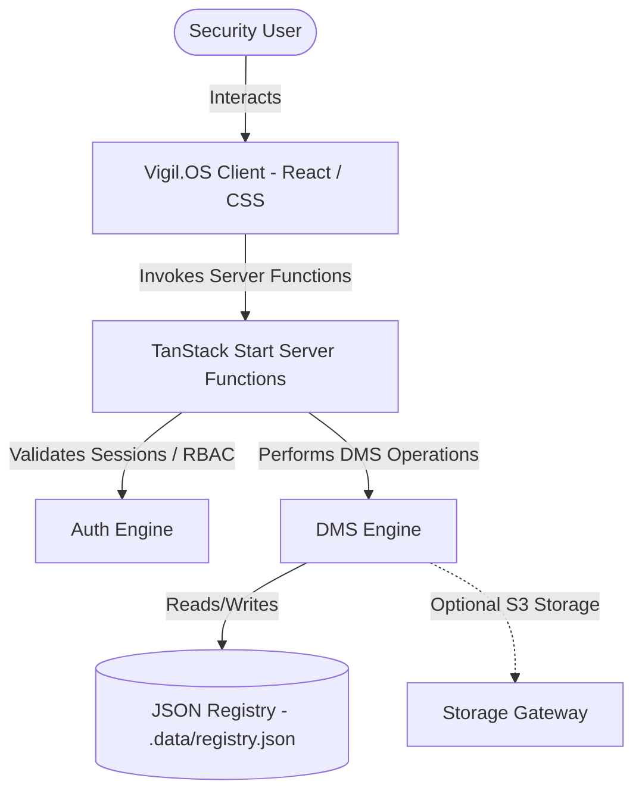

# Vigil.OS — Secure Digital Document Management System

Vigil.OS is a secure, modern, full-stack digital document management system (DMS) built on TanStack Start. It is designed for law enforcement agencies, courts, legal departments, and investigation teams to securely archive, manage, and audit sensitive legal files and case dossiers.

---

## 🏛️ System Architecture



---

## 🔑 Role Clearance Matrix

The application implements granular Role-Based Access Control (RBAC) across five clearance levels:

| Role | Access Level | Description & Clearance Privileges |
| :--- | :--- | :--- |
| **Admin** | Level 5 | Full system control: User management, reclassification, digital signing, and lifecycle control. |
| **Investigator** | Level 4 | Dossier management: Upload documents, trigger reclassification, digitally sign, and approve workflows. |
| **Legal Officer** | Level 3 | Docket management: Retrieve dockets, upload documents, and apply digital signatures. |
| **Court Officer** | Level 2 | Case tracking: Access docket indices, upload records, and track case statuses. |
| **Viewer** | Level 1 | Restricted access: Gated read-only metadata inspection. |

---

## 📁 Repository Directory Structure

```
judicator-docs/
├── .data/
│   └── registry.json         # Local persistent JSON database
├── public/
│   ├── favicon.png           # Custom security shield tab icon
│   └── robots.txt
├── src/
│   ├── components/
│   │   ├── dms/              # Case dossier and workflow components
│   │   └── ui/               # Reusable presentation components
│   ├── hooks/                # React state & lifecycle hooks
│   ├── lib/
│   │   ├── auth.server.ts    # Authentication and session handling
│   │   ├── dms.server.ts     # Dossier management service layer
│   │   ├── registry.server.ts# Database adapter
│   │   └── error-reporting.ts# Runtime exception telemetry
│   ├── routes/               # File-based routing pages
│   ├── router.tsx            # Router initialization
│   ├── server.ts             # SSR server entry point
│   ├── start.ts              # Client shell mount
│   └── styles.css            # Application global styles
├── tsconfig.json             # TypeScript configuration
└── vite.config.ts            # Vite build configuration
```

---

## 🛠️ Key Technical Features

* **Granular Document Sharing**: Secure, time-bound sharing between users with optional download/read-only permissions.
* **Workflow State Machine**: Gated document lifecycle: `Draft` ➔ `Under Review` ➔ `Approved/Rejected` ➔ `Sealed` ➔ `Signed` ➔ `Archived`.
* **Cryptographic Integrity**: SHA-256 client/server hashing on file uploads, with alert banners to flag hash mismatches.
* **Audit Logging**: Immutable, automated logging of all system actions (logins, uploads, sharing, clearance modifications).
* **Responsive Dashboard**: Recharts-based statistics for case priority, review tasks, and classification levels.

---

## 🚀 Getting Started

### 📋 Prerequisites
- **Node.js** (v18 or higher)
- **npm** (v9 or higher)

### 📥 Installation & Local Setup

1. **Clone the repository**:
   ```bash
   git clone <repository-url>
   cd judicator-docs
   ```

2. **Install dependencies**:
   ```bash
   npm install
   ```

3. **Start the local development server**:
   ```bash
   npm run dev
   ```
   The application will be accessible at: `http://localhost:8080`

4. **Verify / Build for Production**:
   ```bash
   npm run build
   ```

---

## 🎫 Seed Demo Credentials

Use these pre-configured user credentials to explore different roles and access controls:

| Email | Password | Role | Badge ID |
| :--- | :--- | :--- | :--- |
| `admin@vigil.os` | `admin123` | **Admin** | `REC-0001` |
| `investigator@vigil.os` | `invest123` | **Investigator** | `MH-1180` |
| `legal@vigil.os` | `legal123` | **Legal Officer** | `PP-0092` |
| `court@vigil.os` | `court123` | **Court Officer** | `MH-4471` |
| `viewer@vigil.os` | `viewer123` | **Viewer** | `FSL-303` |
